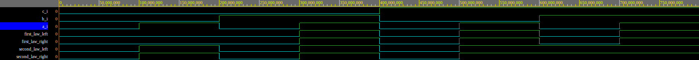

# Lab 1: Filip Stryk

### De Morgan's laws

1. Original function and its variants using only NOR, NAND and NOT logic gates.

   

2. Functions from the picture above written in VHDL.

```vhdl
architecture dataflow of gates is
begin
    f_org_o  <= (not(b_i) and a_i) or (not(c_i) and not(b_i));
    f_nand_o <= (not(b_i) nand a_i) nand (not(c_i) nand not(b_i));
    f_nor_o  <= not((b_i nor not(a_i)) nor (c_i nor b_i));
end architecture dataflow;
```

3. Truth table of the above functions.

| **c** | **b** |**a** | **f(c,b,a)_ORG** | **f(c,b,a)_NAND** | **f(c,b,a)_NOR** |
| :-: | :-: | :-: | :-: | :-: | :-: |
| 0 | 0 | 0 | 1 | 1 | 1 |
| 0 | 0 | 1 | 1 | 1 | 1 |
| 0 | 1 | 0 | 0 | 0 | 0 |
| 0 | 1 | 1 | 0 | 0 | 0 |
| 1 | 0 | 0 | 0 | 0 | 0 |
| 1 | 0 | 1 | 1 | 1 | 1 |
| 1 | 1 | 0 | 0 | 0 | 0 |
| 1 | 1 | 1 | 0 | 0 | 0 |

### Distributive laws

1. Simulated waveforms of functions representing two distributive laws.

   

2. [Here](https://www.edaplayground.com/x/Bhjf) you can find an EDA playground example with distributive laws in VHDL.