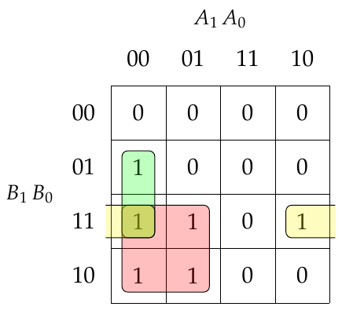
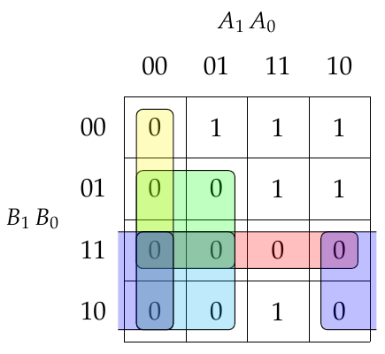
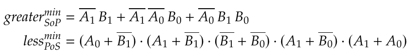
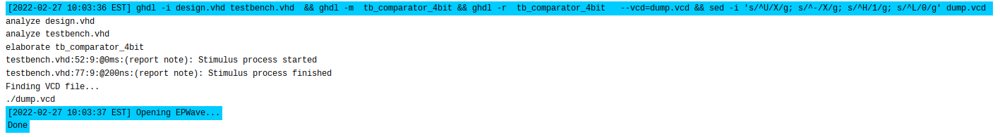

# Lab 2: Filip Stryk

### 2-bit comparator

1. Karnaugh map for the function *B is greater than A*:

   

   Karnaugh map for the function *B is less than A*:

   

2. Equations of simplified SoP (Sum of the Products) form of the "greater than" function and simplified PoS (Product of the Sums) form of the "less than" function.

   

### 4-bit comparator

1. Listing of VHDL stimulus process from testbench file (`testbench.vhd`).

   Last two digits of my student ID: 2303**22**

```vhdl
   p_stimulus : process
	begin
      -- Report a note at the beginning of stimulus process
      report "Stimulus process started" severity note;

      -- First test case
      s_b <= "0010"; -- 2
      s_a <= "0010"; -- 2
      wait for 100 ns;
      -- Expected output
      assert ((s_B_greater_A = '0') and
               (s_B_equals_A  = '1') and
               (s_B_less_A    = '0'))
      -- If false, then report an error
      report "Input combination A = 0010 and B = 0010 FAILED" severity error;
      
      -- Second test case
      s_b <= "0010";
      s_a <= "0000";
      wait for 100 ns;
      -- Expected output
      assert ((s_B_greater_A = '1') and
               (s_B_equals_A  = '0') and
               (s_B_less_A    = '0'))
      -- If false, then report an error
      report "Input combination A = 0010 and B = 0000 FAILED" severity error;

      -- Report a note at the end of stimulus process
      report "Stimulus process finished" severity note;
      wait;
   end process p_stimulus;
```

2. Text console screenshot during simulation, including reports.

   

3. Link to public EDA Playground example:

   [[BPC-DE1] Lab 02 - 4-bit comparator](https://www.edaplayground.com/x/k8RD)
