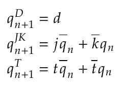

# Preparations for the lab 05

## Characteristic equations of D, JK and T flip-flops

## Truth tables of D, JK and T flip-flops
**D-type FF**
   | **clk** | **d** | **q(n)** | **q(n+1)** | **Comments** |
   | :-: | :-: | :-: | :-: | :-- |
   |  | 0 | 0 | 0 | Set `q(n+1)` to 0 |
   |  | 0 | 1 | 0 | Set `q(n+1)` to 0 |
   |  | 1 | 0 | 1 | Set `q(n+1)` to 1 |
   |  | 1 | 1 | 1 | Set `q(n+1)` to 1 |

   **JK-type FF**
   | **clk** | **j** | **k** | **q(n)** | **q(n+1)** | **Comments** |
   | :-: | :-: | :-: | :-: | :-: | :-- |
   |  | 0 | 0 | 0 | 0 | Output did not change |
   |  | 0 | 0 | 1 | 1 | Output did not change |
   |  | 0 | 1 | 0 | 0 | Reset |
   |  | 0 | 1 | 1 | 0 | Reset |
   |  | 1 | 0 | 0 | 1 | Set |
   |  | 1 | 0 | 1 | 1 | Set |
   |  | 1 | 1 | 0 | 1 | Toggle |
   |  | 1 | 1 | 1 | 0 | Toggle |

   **T-type FF**
   | **clk** | **t** | **q(n)** | **q(n+1)** | **Comments** |
   | :-: | :-: | :-: | :-: | :-- |
   |  | 0 | 0 | 0 | Output did not change |
   |  | 0 | 1 | 1 | Output did not change |
   |  | 1 | 0 | 1 | Toggle |
   |  | 1 | 1 | 0 | Toggle |