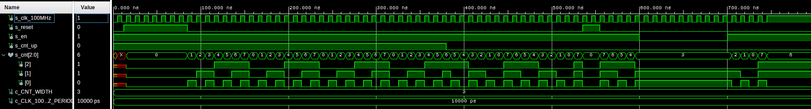
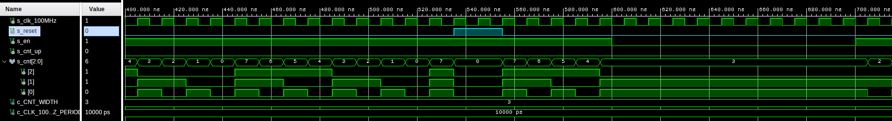
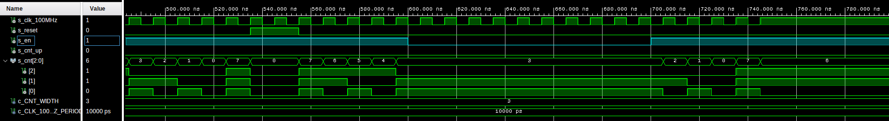
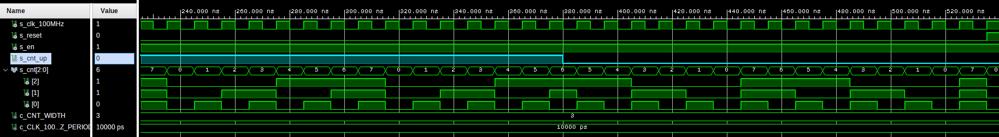
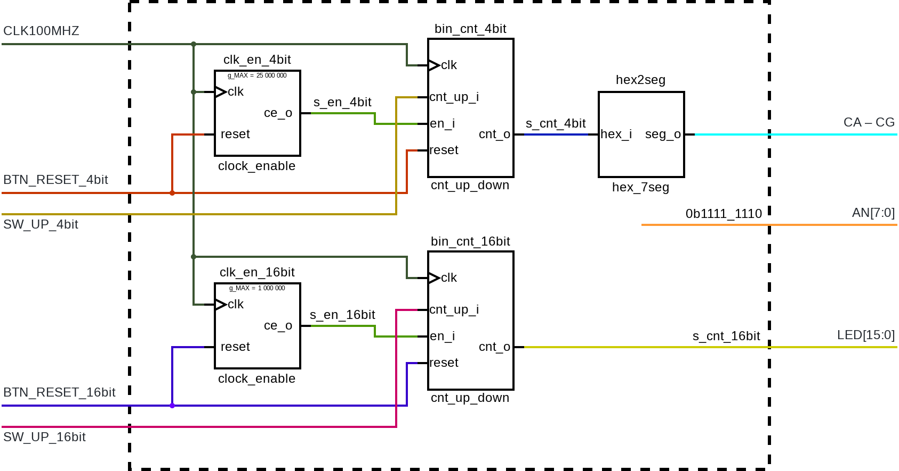
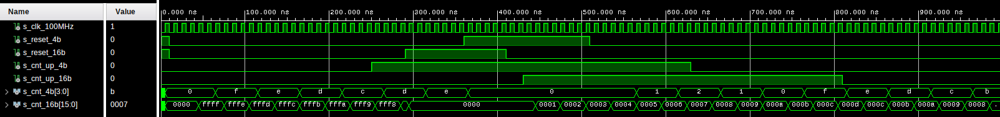

# Lab 6: Filip Stryk

### Bidirectional counter

1. Process `p_cnt_up_down`.

```vhdl
    p_cnt_up_down : process(clk)
    begin
        if rising_edge(clk) then
        
            if (reset = '1') then   -- Synchronous reset
                s_cnt_local <= (others => '0'); -- Clear all bits

            elsif (en_i = '1') then -- Test if counter is enabled

                if (cnt_up_i = '1') then
                    s_cnt_local <= s_cnt_local + 1;
                else
                    s_cnt_local <= s_cnt_local - 1;
                end if;

            end if;
        end if;
    end process p_cnt_up_down
```

2. Simulater waaveforms of 3bit counter.

   - Full waveforms
   

   - `s_reset`
   

   - `s_en`
   

   - `s_cnt_up`
   

### Two counters

1. Image of the top layer structure with two independent counters (4bit and 16bit).
    

2. Simulated waveforms of the top layer.
    
